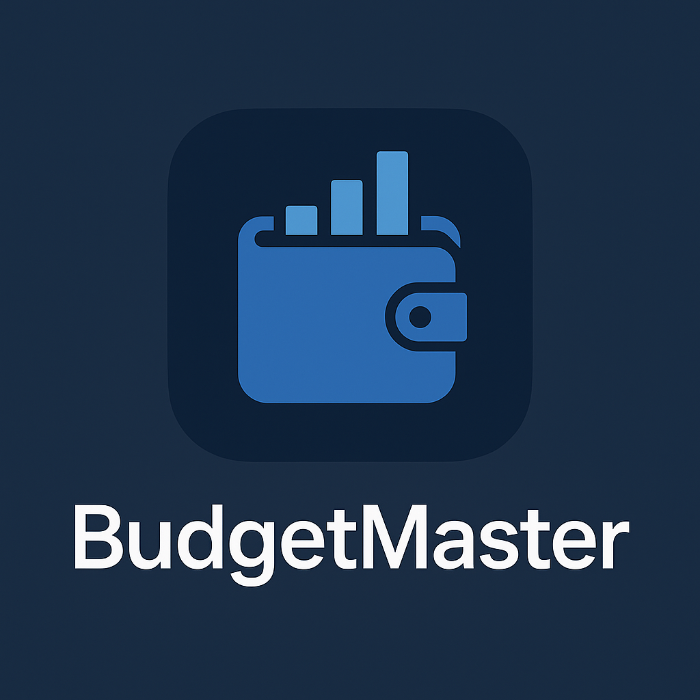

<p align="center"></p>

# BudgetMaster 💰

[](https://opensource.org/licenses/MIT)

BudgetMaster es una aplicación Android nativa diseñada para la gestión de finanzas personales de manera sencilla. Registra tus ingresos y gastos, categoriza transacciones y monitorea tu progreso hacia tus metas de ahorro.

## ✨ Características Principales

*   **Seguimiento de Transacciones:** Registra fácilmente ingresos y gastos.
*   **Categorización:** Asigna categorías a las transacciones para un mejor análisis.
*   **Metas de Ahorro:** Establece y sigue tus objetivos financieros.
*   **Reportes:** Visualiza patrones de gasto (Planeado).
*   **Dashboard:** Obtén una visión general rápida de tu estado financiero (Planeado).
*   **Offline First:** Los datos se almacenan localmente usando la persistencia de Room.

## 📸 Capturas de Pantalla

TODO:

**Ejemplo:**
``
``

## 🛠️ Tecnologías y Arquitectura

*   **Lenguaje:** [Kotlin](https://kotlinlang.org/)
*   **UI Toolkit:** [Jetpack Compose](https://developer.android.com/jetpack/compose)
*   **Arquitectura:** MVVM (Model-View-ViewModel)
*   **Persistencia de Datos:** [Room](https://developer.android.com/training/data-storage/room) (Wrapper de SQLite)
*   **Navegación:** [Navigation Compose](https://developer.android.com/jetpack/compose/navigation)
*   **Gestión de Dependencias:** Gradle con Catálogo de Versiones (`libs.versions.toml`)

## 🏗️ Estructura del Proyecto

El proyecto sigue el patrón de arquitectura MVVM para una clara separación de responsabilidades, mejorando la testeabilidad y mantenibilidad.

*   **`data`**: Contiene modelos de datos (`Transaction`, `Category`, `Goal`), DAOs, base de datos Room (`AppDatabase`), patrón repositorio (`BudgetRepository`), y convertidores de datos.
*   **`ui`**: Incluye pantallas de Jetpack Compose, ViewModels para cada pantalla, configuración de navegación (`Screen.kt`), componentes de UI (`BottomNavigationBar`), y definiciones de tema.
*   **`di` / `app`**: Configuración básica de provisión de dependencias dentro de `BudgetMasterApplication`.

## 🚀 Cómo Empezar

### Prerrequisitos

*   Android Studio (Última versión estable recomendada)
*   Android SDK
*   Emulador o Dispositivo Android Físico

### Instalación y Compilación

1.  **Clona el repositorio:**
    ```bash
    git clone https://github.com/Johnson1255/BudgetMaster.git 
    cd BudgetMaster
    ```
2.  **Abre en Android Studio:**
    *   Inicia Android Studio.
    *   Selecciona "Open an existing project".
    *   Navega al directorio `BudgetMaster` clonado y ábrelo.
3.  **Sincroniza Gradle:**
    *   Android Studio debería sincronizar automáticamente el proyecto con los archivos Gradle. Si no, ve a `File > Sync Project with Gradle Files`.
4.  **Ejecuta la aplicación:**
    *   Selecciona un emulador o conecta un dispositivo físico.
    *   Haz clic en el botón "Run" (icono de reproducción verde) en Android Studio.

## 🗺️ Hoja de Ruta (Roadmap)

Esto es lo que está planeado para el desarrollo futuro:

*   [ ] **Implementar Pantallas Centrales:**
    *   [ ] Dashboard (Resúmenes, actividad reciente, progreso de metas)
    *   [ ] Gestión de Metas (Listar, Crear, Editar, Eliminar)
    *   [ ] Reportes (Gráficos de gastos por categoría)
    *   [ ] Gestión de Categorías
    *   [ ] Formulario Añadir/Editar Transacción
    *   [ ] Formulario Añadir/Editar Meta
*   [ ] **Conectar Navegación:** Habilitar los flujos de navegación entre pantallas.
*   [ ] **Refinamiento de UI:** Reemplazar placeholders, implementar gráficos, pulir formularios y estilos.
*   [ ] **Lógica de Negocio:** Implementar operaciones CRUD en ViewModels, cálculos para reportes/dashboard.
*   [ ] **Pruebas (Testing):** Añadir pruebas unitarias y de instrumentación completas.
*   [ ] **Opcional:** Precargar categorías por defecto.

## 🛡️ Seguridad

La seguridad de este proyecto es importante. Por favor, revisa nuestra [Política de Seguridad](SECURITY.md) para entender cómo reportar vulnerabilidades.

## 🤝 Contribuciones

¡Las contribuciones son bienvenidas! Si deseas contribuir, por favor sigue estos pasos:

1.  Haz un Fork del Proyecto
2.  Crea tu Rama de Característica (`git checkout -b feature/AmazingFeature`)
3.  Confirma tus Cambios (`git commit -m 'Add some AmazingFeature'`)
4.  Empuja a la Rama (`git push origin feature/AmazingFeature`)
5.  Abre una Pull Request

Por favor, asegúrate de que tu código se adhiera al estilo de codificación del proyecto e incluya pruebas donde sea aplicable.

## 📄 Licencia

Este proyecto está bajo la Licencia MIT - mira el archivo [LICENSE](LICENSE) para más detalles.
